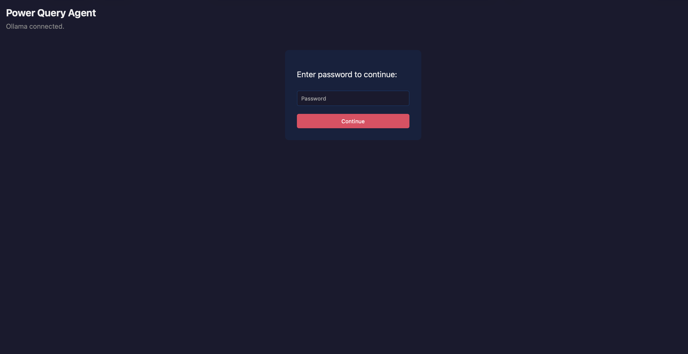
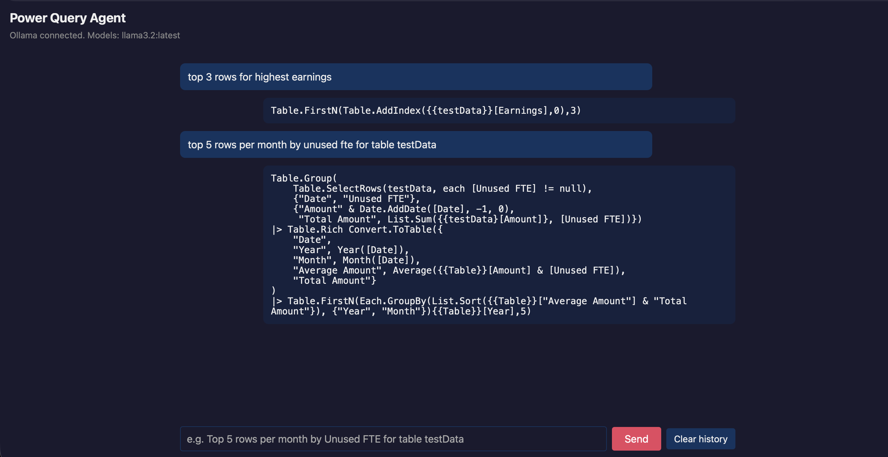

# Power Query Agent (local)

We created a **local Power Query agent**: a small web app (plain HTML/JS frontend + Python backend) that uses **Ollama** (local LLM) to generate Power Query M code from natural language. No data leaves your machine — all prompts and answers stay local.

## What it looks like

**Login (password required):**  
Enter the password to access the chat. Wrong password shows an error and lets you retry; you cannot reach the chat until authentication succeeds.



**Chat (after login):**  
You type requests in plain language (e.g. “top 5 rows per month by Unused FTE for table testData”). The agent returns Power Query M code; you can copy it into Excel’s Power Query Advanced Editor. Conversation history is kept for the session; you can clear it with “Clear history”.



---

## 1. Install Ollama and pull a model

**macOS (Homebrew):**
```bash
brew install ollama
```

**Windows / Linux:** Download from [ollama.com](https://ollama.com).

**Start Ollama and pull a small model:**
```bash
ollama serve          # start server (or run "Ollama" app)
ollama pull llama3.2  # or: ollama pull phi3
```

Use `llama3.2` (default in this app) or set `OLLAMA_MODEL=phi3` for a smaller model.

## 2. Python env and run backend

From the **agent** folder:

```bash
cd agent
python3 -m venv .venv
source .venv/bin/activate   # Windows: .venv\Scripts\activate
pip install -r requirements.txt
uvicorn main:app --host 0.0.0.0 --port 8000
```

Or use the helper script: `./run.sh`

## 3. Open in browser

Go to: **http://localhost:8000**

- Log in with the password (default **12345**).
- Type a request (e.g. “Top 5 rows per month by Unused FTE for table testData”).
- The agent returns Power Query M code; copy it into Excel Power Query Advanced Editor.

## Password

Default password is **12345**. To change it, set the `PASSWORD` env var when starting the backend (e.g. `PASSWORD=yourpass ./run.sh`). Wrong password shows “Wrong password. Try again.” and does not allow access until the correct password is entered.

## Env vars

| Variable       | Default              | Description                    |
|----------------|----------------------|--------------------------------|
| `OLLAMA_URL`   | `http://127.0.0.1:11434` | Ollama API base URL        |
| `OLLAMA_MODEL` | `llama3.2`           | Model name to use              |
| `PASSWORD`     | `12345`              | Chat requires this password (Bearer token) |

## Data and privacy

- All prompts and answers stay on your machine.
- Ollama runs locally; no Excel or data is sent to the cloud.
